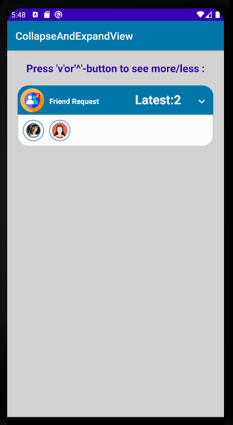
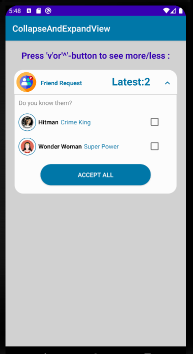

# CollapseAndExpand-Android
Without card-view : Custom layout implementation for collapse and expand view using Linear Layout.

 

# Please see first "activity_main.xml" and then try the following code:
Here "btn_colExp" is a "Button", "layout_colExpHeader"/"layout_exp"/"layout_col" are "Linear Layout", "textMedCategory"/"textMedTime" are "TextView" type objects holding respective IDs from "activity_main.xml" file.

```java
btn_colExp.setOnClickListener(new View.OnClickListener() {
            @Override
            public void onClick(View v) {
                if(layout_exp.getVisibility()==View.GONE){
                    TransitionManager.beginDelayedTransition(layout_main, new AutoTransition());
                    layout_colExpHeader.setBackgroundResource(R.drawable.rounded_up_rec_white);
                    textMedCategory.setTextColor(getResources().getColor(R.color.colorPrimary));
                    textMedTime.setTextColor(getResources().getColor(R.color.colorPrimary));
                    btn_colExp.setBackgroundResource(R.drawable.ic_expand_less_24dp);
                    layout_exp.setVisibility(View.VISIBLE);
                    layout_col.setVisibility(View.GONE);
                }else {
                    TransitionManager.beginDelayedTransition(layout_main, new AutoTransition());
                    layout_colExpHeader.setBackgroundResource(R.drawable.rounded_up_rectangle);
                    textMedCategory.setTextColor(getResources().getColor(R.color.colorWhite));
                    textMedTime.setTextColor(getResources().getColor(R.color.colorWhite));
                    btn_colExp.setBackgroundResource(R.drawable.ic_expand_more_white_24dp);
                    layout_exp.setVisibility(View.GONE);
                    layout_col.setVisibility(View.VISIBLE);
                }
            }
        });
```
Enjoy!
